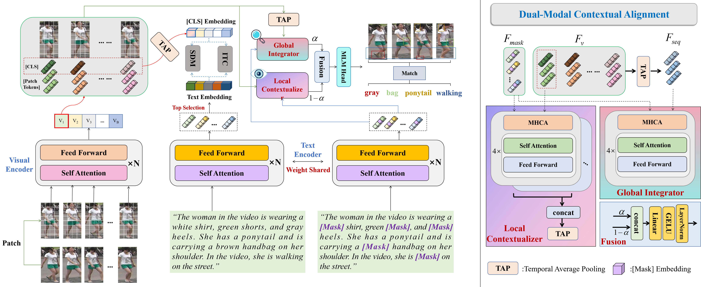

# Text-to-video Person Re-identification Benchmark: Dataset and Dual-Modal Contextual Alignment
[](https://github.com/anosorae/IRRA/blob/main/LICENSE) [](https://paperswithcode.com/sota/nlp-based-person-retrival-on-cuhk-pedes?p=cross-modal-implicit-relation-reasoning-and)

Official PyTorch implementation of the paper Text-to-video Person Re-identification Benchmark: Dataset and Dual-Modal Contextual Alignment.

## Updates
- (11/30/2025) Code released!


## Highlights
Text-to-video person re-identification aims to identify individuals in video sequences based on textual descriptions, but it faces challenges such as the scarcity of large-scale annotated datasets and the semantic gap between static text and dynamic video content. To address these issues, we introduce TV-MARS, a benchmark built on the MARS dataset with 16,360 text-video pairs, enriched with natural language annotations describing motion states and environmental interactions. At approximately 4.8× larger than existing text-to-video person re-identification benchmarks, TV-MARS provides a more comprehensive resource for research. Additionally, we propose a Dual-Modal Contextual Alignment (DMCA) method that addresses the unique challenges of text-video alignment through a specialized dual-granularity architecture. Unlike conventional cross-modal methods that treat alignment as a single-scale matching problem, DMCA introduces a novel dual-path design: a local contextualizer that establishes fine-grained correspondence between textual attributes and spatial visual features, and a global integrator that captures temporal dynamics and motion patterns across video sequences. These complementary alignment pathways are adaptively fused through a dynamic weighting mechanism, creating a unified representation that effectively bridges the modality gap between static descriptions and dynamic visual content. This multi-granularity contextual alignment strategy enables robust semantic consistency across modalities, specifically addressing the spatial-temporal complexity inherent in text-to-video matching. Experiments show that DMCA achieves a +8.88% improvement in rank-1 accuracy, significantly advancing the state-of-the-art in text-to-video person re-identification.



## Usage
### Requirements
we use single RTX3090 24G GPU for training and evaluation. 
```
pytorch 2.1.1
torchvision 0.16.1
prettytable
easydict
```

### Prepare Datasets
Download the MARS dataset from [here](https://zheng-lab-anu.github.io/Project/project_mars.html), and our annotation files from [here](链接: https://pan.baidu.com/s/1co7U-sKj823PXQmrB42_iQ?pwd=qwer 提取码: qwer)

Organize them in `your dataset root dir` folder as follows:
```
|-- your dataset root dir/
|   |-- <bbox_train>/
|       |-- 0001
|       |-- 0003
|       ...
|   |-- <bbox_test>/
|       |-- 0002
|       |-- 0004
|       ...
|   |-- <train_info>/
|   |-- <test_gallery_info>/
|   |-- <test_query_info>/
|       ...
```

## Training

```
CUDA_VISIBLE_DEVICES=0 \
python train.py \
--img_aug \
--batch_size 32 \
--dataset_name $DATASET_NAME \
--loss_names 'msc+vtc' \
--num_epoch 60 \
--MLM \
--eval_period 5 \
--sampler 'random' \
--test_mode 'rss' \
--pretrain_choice 'ViT-B/32'
```


## Testing

```
python test.py --config_file 'path/to/model_dir/configs.yaml'
```

## Acknowledgments
Some components of this code implementation are adopted from [CLIP](https://github.com/openai/CLIP), [IRRA](https://github.com/anosorae/IRRA). We sincerely appreciate for their contributions.


[//]: # (## Citation)

[//]: # (If you find this code useful for your research, please cite our paper.)

[//]: # ()
[//]: # (```tex)

[//]: # (@inproceedings{cvpr23crossmodal,)

[//]: # (  title={Cross-Modal Implicit Relation Reasoning and Aligning for Text-to-Image Person Retrieval},)

[//]: # (  author={Jiang, Ding and Ye, Mang},)

[//]: # (  booktitle={IEEE International Conference on Computer Vision and Pattern Recognition &#40;CVPR&#41;},)

[//]: # (  year={2023},)

[//]: # (})

[//]: # (```)

## Contact
If you have any question, please feel free to contact us. E-mail: [jiajunsu@hqu.edu.cn](mailto:jiajunsu@hqu.edu.cn), [jqzhu@hqu.edu.cn](mailto:jqzhu@hqu.edu.cn).
